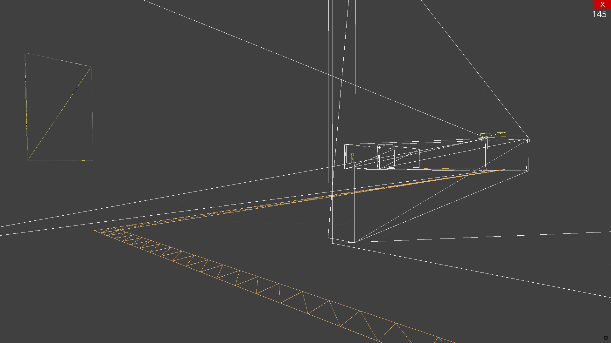

# 💻 ImitationGameExit8

## Preview



## Introduction

> 파이썬 Ursina 엔진을 사용해 8번출구 라는 게임을 간단히 구현해 보자.\
> [Non-Euclidean Worlds Engine](https://youtu.be/kEB11PQ9Eo8?si=e83IAPbnN9dXyUEe) 기술 적용.

## Requirements

> 프로젝트에 필요한 환경.

* **Environment**
    * Windows

* **Package**
    * Ursina\
      ``` pip install ursina ```